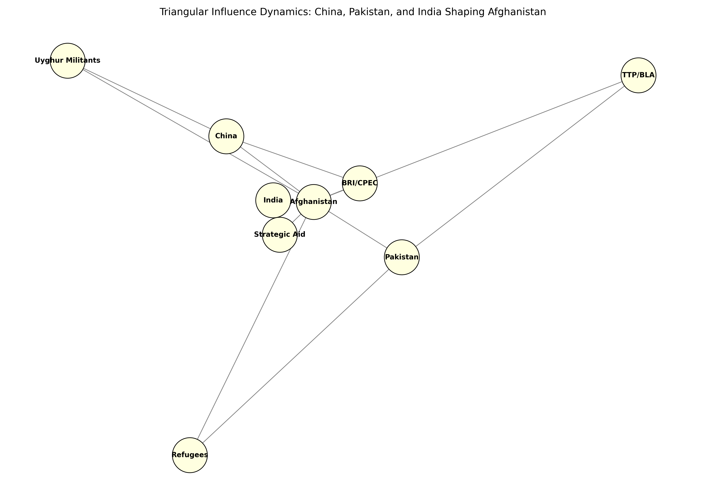

# Axis of Leverage: How China, Pakistan, and India Weaponize Afghanistan’s Weakness
*By Ronald J. Botelho*

---

## 📍 Introduction

In international affairs, weakness is never neutral. It attracts pressure, invites manipulation, and becomes a vessel for someone else’s design. Nowhere is this more visible than in Afghanistan—where three regional powers, once bitterly divided, now circle a fragile regime with calibrated intent.

**China builds roads. Pakistan builds fences. India sends aid. All are constructing influence.**

This article maps the triangular system of pressure that China, Pakistan, and India exert on Afghanistan—and how the Taliban, often underestimated, has learned to play them off one another in a balancing act more complex than war itself.

---

## 🌐 Influence Map

*Figure: Triangular Influence Dynamics of China, Pakistan, and India in Afghanistan (Botelho, 2025)*

---

## 🧭 Structural Outline

### 1. System Overview
- Afghanistan is the pivot point in a pressure triangle formed by China, Pakistan, and India.
- Each actor deploys a distinct strategy: infrastructure, security, and soft power.

### 2. Actor-by-Actor Analysis

#### 🏗️ China
- Objectives: secure Belt and Road Initiative (BRI) expansion, mineral access, Xinjiang buffer (Zhou, 2024).
- Tactics: recognizing Taliban diplomats, investing in mining, integrating Afghanistan into CPEC.

#### 🛡️ Pakistan
- Objectives: contain TTP and BLA, control refugee flows, preserve influence in Kabul (Khan, 2023).
- Tactics: forced deportations, military pressure at the border, back-channel talks with Taliban leaders.

#### 🕊️ India
- Objectives: counterbalance China-Pakistan alliance, ensure regional trade routes, maintain goodwill (Mehta, 2023).
- Tactics: humanitarian aid, informal diplomatic outreach, investment in regional ports like Chabahar.

---

## 🔁 Taliban as a Strategic Actor
- Sells recognition for access to resources.
- Plays powers off one another to prevent dominance.
- Benefits from controlled instability (Rahimi, 2024).

---

## 🔄 Feedback Loops and Risk Vectors
- Recognition → Legitimacy → International Funding → Increased Taliban control.
- Regional tension → Domestic nationalism → Military escalation (Ghosh, 2023).

---

## 🔮 Strategic Scenarios

| Scenario              | Outcome Description                                 | Primary Beneficiaries       |
|-----------------------|-----------------------------------------------------|------------------------------|
| Stability Deal        | Multilateral investment stabilizes region           | China, Taliban               |
| Controlled Collapse   | Chronic instability maintains leverage              | Taliban, Pakistan            |
| Proxy Spiral          | Escalating conflict between regional rivals         | None (India most at risk)    |

---

## 📚 References (APA 7th Edition)

- Ghosh, P. (2023). *South Asia’s proxy politics and the Afghan vacuum*. Observer Research Foundation.
- Khan, I. (2023). *Pakistan’s refugee strategy and the Taliban*. Dawn News. https://www.dawn.com
- Mehta, S. (2023). *India’s emerging diplomacy with Taliban*. Indian Express. https://www.indianexpress.com
- Rahimi, T. (2024). *Taliban's leverage in regional multipolarity*. Afghan Institute for Strategic Studies (AISS).
- Zhou, Y. (2024). *China’s frontier doctrine and BRI’s western edge*. Journal of Geopolitical Strategy.

---

**Disclaimer:** The views expressed are solely those of the author, Ronald J. Botelho, a Ph.D. student in Complex Sciences at Binghamton University. This article is for academic and public analysis purposes only.

**Disclosure:** Visuals and code for the influence map can be found at: [https://github.com/Ron573/substack-archive](https://github.com/Ron573/substack-archive)
