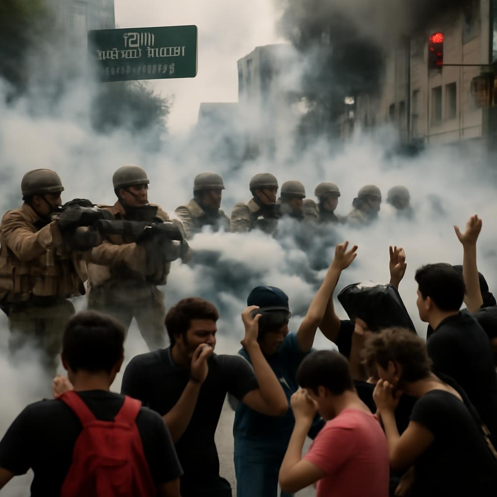

**Federal power has limits—militarizing protest isn’t justice, it’s authoritarianism.**

*National Guard confronts peaceful demonstrators in Los Angeles with tear gas, June 2025. This image reflects the dangerous escalation triggered by Trump's unilateral Title 10 deployment.*

# Unlawful Authority: Rejecting Trump’s Federal Seizure of California’s Guard

**By Ronald J. Botelho**  
Ph.D. Student, Complex Systems  
Binghamton University

---

## ⚖️ Executive Overreach Disguised as Security

Let’s be clear: Donald Trump did **not** have the lawful authority to federalize the California National Guard and deploy 2,000 troops to Los Angeles absent a demonstrable, imminent insurrection or collapse of local law enforcement capacity.

As *Politico* journalist Melanie Mason reported on June 7, 2025, Trump signed a presidential memorandum deploying troops “to address the lawlessness that has been allowed to fester,” despite having no formal request from Governor Gavin Newsom—who sharply rebuked the action as “purposefully inflammatory” and unnecessary (Mason, 2025).

His move wasn’t about restoring order. It was about asserting domination. About turning immigration enforcement into a theater of control. About invoking federal muscle against political opponents under the guise of public safety.

The invocation of **Title 10** and the **Insurrection Act** is a last-resort tool intended for *extraordinary* breakdowns in state governance—not for silencing civil protest or punishing cities that defy a president’s immigration agenda.

---

## 🔍 What Title 10 Does—and Doesn’t Do

**Title 10 of the U.S. Code** governs the armed forces and allows the president to call National Guard units into federal service. Once activated, they serve under presidential control—not the governor’s. But this authority is **not unlimited**.

The **Insurrection Act** (10 U.S.C. §§ 251–255) only authorizes deployment when:

- Domestic violence or unlawful obstruction *prevents execution of federal law*,
- Or when the president deems it *impracticable* to enforce laws via regular channels,
- Or when there is *rebellion against U.S. authority*.

These are **strict statutory thresholds**. They require factual evidence of widespread violence, not political rhetoric or hostility toward dissent.

---

## 📉 No Legal Justification: A Breakdown

Trump’s memo reportedly invokes federal law enforcement under the pretense of an “ongoing insurrection.” But what happened in LA?

According to Mason (2025), the federal action was triggered after community protestors confronted immigration agents conducting workplace raids. One of the highest-profile arrests involved SEIU California union president David Huerta, who was injured and hospitalized after being violently detained by ICE agents—fueling local outrage and condemnation.

- Local ICE raids triggered community protest.  
- Arrests were made, yes—but by immigration authorities.  
- No state of emergency was declared by local officials.  
- Governor Newsom explicitly stated no law enforcement gaps existed.  
- There were no federal buildings under siege or breakdowns in civil order.

Newsom stated: *“There is currently no unmet need. This is the wrong mission and will erode public trust”* (Mason, 2025).

This falls far short of insurrection. The move was political, not protective.

---

## 🛑 Undermining Federalism

The federalization of a state’s National Guard without the governor’s consent is **rare** and **radically escalatory**. In most modern cases, presidents work *with* governors—especially in peacetime.

The last major unilateral use of the Insurrection Act was during the 1992 Los Angeles riots—when widespread violence, looting, and police breakdown led California’s Republican governor to request federal support.

Trump, by contrast, acted unilaterally, in defiance of California’s leadership, absent any collapse in order.

This isn’t about enforcing law. It’s about making an example of Los Angeles. About punishing defiance. About framing migrants and their supporters as enemies of the state.

---

## 🧠 A Systems View: Coercion by Optics

From a systems science lens, Trump’s move weaponizes **feedback loops of state perception**:

1. Media narrative of “lawlessness” fuels federal justification.  
2. Federal deployment escalates tensions, not reduces them.  
3. Protests react, giving visual proof of “unrest.”  
4. Reinforcing loop legitimizes further federal clampdowns.

This is not governance. It’s provocation. It’s authoritarian playbook 101: Create the crisis, then “solve” it with force.

---

## 🛡️ The True Danger: Normalizing Federal Force Against Dissent

If this tactic stands unchallenged, what’s next?

Will protests against environmental degradation be called “insurrection”?  
Will journalists be accused of “aiding rebellion”?  
Will governors opposing the president’s immigration policy see their Guard units hijacked?

It’s a dangerous slope. One that erodes the **principle of cooperative federalism**, the **civilian oversight of military force**, and the **right to dissent**.

This must be called what it is: authoritarian encroachment cloaked in legality.

---

## 📢 Five Powerful Sentences

1. This article categorically rejects Donald Trump’s unlawful seizure of the California National Guard as an authoritarian overreach.  
2. It dissects the legal failures of invoking Title 10 without a valid insurrection, revealing a dangerous manipulation of federal authority.  
3. Through a systems lens, it shows how optics and escalation are being weaponized to normalize military force against lawful protest.  
4. It warns that this deployment sets a terrifying precedent where dissent can be branded as rebellion and met with armed force.  
5. It urges immediate public recognition and resistance to the creeping authoritarianism wrapped in the language of law and order.

---

## 📚 References (APA 7th Edition)

Banks, W. C., & Dycus, S. (2006). *Soldiers on the home front: The domestic role of the American military*. Harvard University Press.  
Cole, D. (1995). *No Equal Justice: Race and Class in the American Criminal Justice System*. The New Press.  
Mason, M. (2025, June 7). *Newsom denounces Trump’s plan to deploy National Guard to LA*. Politico. https://www.politico.com/news/2025/06/07/newsom-national-guard-los-angeles-00393526  
Vladeck, S. I. (2020). *Emergency Powers and the Constitution*. *University of Chicago Law Review, 87*(3), 851–899.  
U.S. Code. (2024). 10 U.S.C. § 251–255 – Insurrection Act. https://www.law.cornell.edu/uscode/text/10/251

---

## 📣 Disclaimer

Ronald J. Botelho is a Ph.D. student at Binghamton University. This article reflects the author's personal views and does not represent the official position of the University or any affiliated institution.

---

## 🪪 Licensing

This article is published under the **Creative Commons Attribution 4.0 International License (CC BY 4.0)**. You are free to share and adapt this material for any purpose, including commercial use, with attribution.

